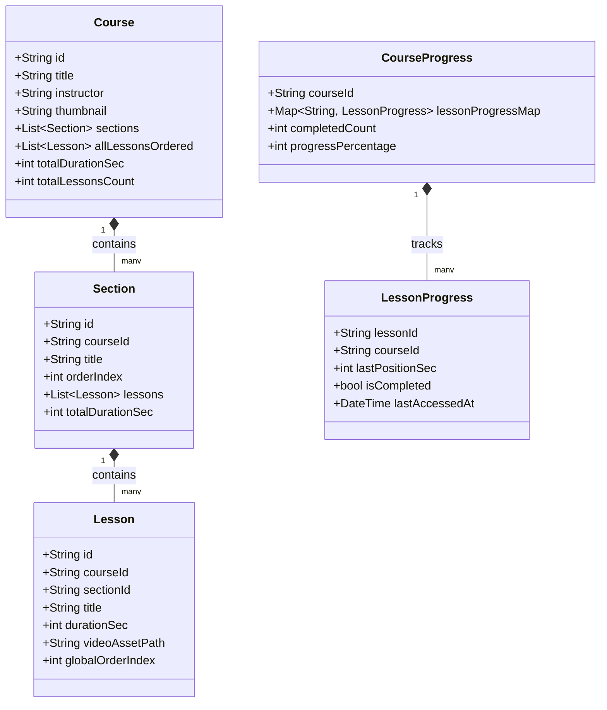
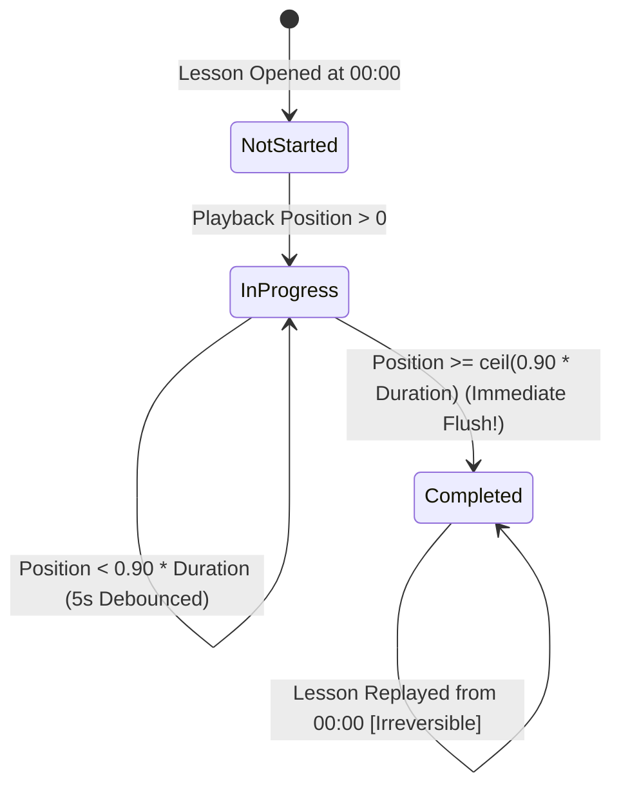
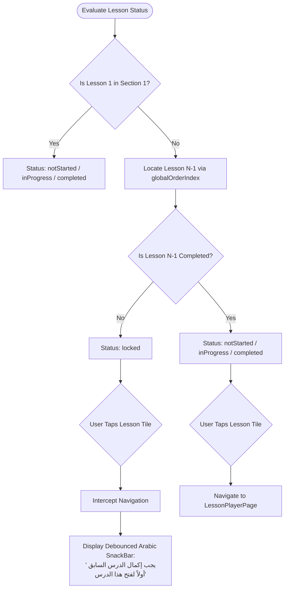
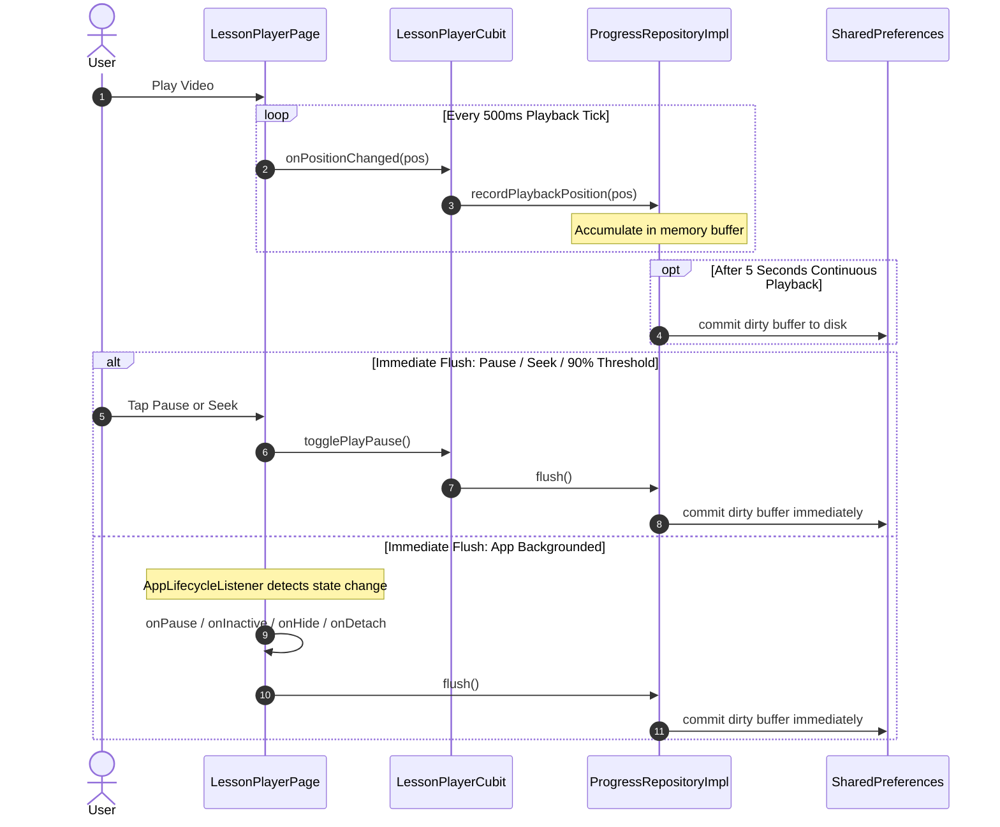
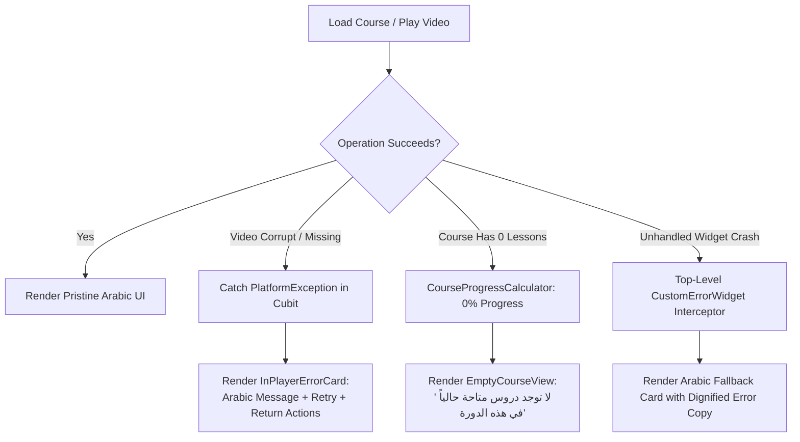

# System Flows & Architecture Diagrams

> **Visual architectural diagrams, state machine progressions, and lifecycle interaction flows.**

---

## 1. Domain Entities & Relationships

---

## 2. 90% Auto-Completion State Progression

---

## 3. Sequential Unlocking Flow Across Sections

---

## 4. Hybrid Persistence & Lifecycle Flush Flow

---

## 5. Zero Red Screens Fault Tolerance Flow

